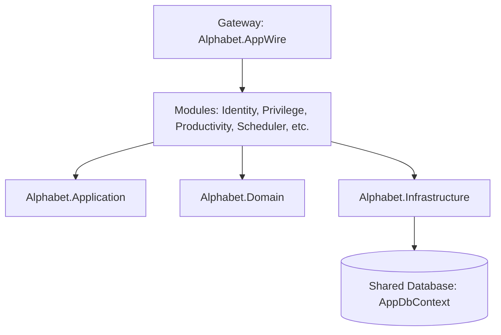

# Alphabet Project Developer Reference Wiki

Welcome to the **Alphabet** developer reference wiki. This document serves as the primary technical guide for engineers onboarding, building, and maintaining the Alphabet application.

---

## 1. Architectural Overview

Alphabet is structured as a **Modular Monolith** designed around **Clean Architecture** principles. Rather than splitting features into physically disconnected microservices—which introduces network latency, distributed transaction complexity, and deployment overhead—Alphabet groups features into logical domain modules. These modules share a single database context, but strictly separate their API, Application, Domain, and Infrastructure concerns.



### Module Project Structure & Compile-Time Linking
To ensure clean code boundaries without excessive compilation overhead, modules reside under `/src/Modules/` but compile directly into the core layers:
- **`src/Gateway/Alphabet.AppWire`**: The entry host (ASP.NET Core Web API). It maps the module endpoints and registers global middleware.
- **`src/Core/Alphabet.Domain`**: Compiles all domain entities, enums, value objects, and repository interfaces from the modules using MSBuild `<Compile Include="...">` links.
- **`src/Core/Alphabet.Application`**: Compiles all commands, queries, validators, and mappers using similar MSBuild compilation targets.
- **`src/Core/Alphabet.Infrastructure`**: Compiles all EF Core configurations, persistence repositories, and external service integrations.

This structure allows developers to locate all code for a single module in one directory, while maintaining a pure clean-architecture boundary at compile-time.

---

## 2. Technology Stack & Key Frameworks

- **Runtime**: .NET 10
- **Database Engine**: Supports **PostgreSQL** (via `Npgsql.EntityFrameworkCore.PostgreSQL`), **SQL Server**, and **InMemory** providers.
- **API Engine**: ASP.NET Core Minimal APIs with built-in versioning (defaulting to API Version `1.0`).
- **MediatR**: Facilitates clean separation of commands and queries (CQRS pattern) and runs validation/logging pipelines.
- **FluentValidation**: Performs automated incoming request model validations in the pipeline.
- **AutoMapper**: Simplifies DTO-to-entity mapping rules.
- **Job Schedulers**: Integrated with **Hangfire** (default with database backing) and **Quartz** (alternative provider) for executing long-running or background processes.
- **Real-Time Gateway**: **SignalR** is configured to support immediate in-app notifications and background status alerts.
- **Logging**: Structured JSON logging handled via **Serilog** configured to output to Console and File targets.
- **API Documentation**: **Swagger UI** configured with a Dark Theme switcher for clean runtime inspection.

---

## 3. Core Directory Reference (Modules)

Alphabet is divided into the following key logical modules:

### 3.1. Identity Module
Responsible for user administration, authentication, security stamps, and Multi-Factor Authentication (MFA).

- **Public Endpoints**:
  - `POST /api/v1/auth/register` - Provision a standard account.
  - `POST /api/v1/auth/login` - Exchange credentials for a JWT. Supports cookie authentication.
  - `POST /api/v1/auth/logout` - Invalidate active session tokens and cookies.
  - `POST /api/v1/auth/confirm-email` - Validate token to active new accounts.
  - `POST /api/v1/auth/forgot-password` & `POST /api/v1/auth/reset-password` - Standard password recovery flow.
  - `POST /api/v1/auth/refresh-token` - Exchange an active refresh token for a new access token.
- **MFA Endpoints**:
  - Setup and verification endpoints for Authenticator App (TOTP) and SMS OTP methods.
- **Admin Endpoints** (Requires `AdminOnly` policy):
  - `POST /api/v1/admin/users` - Admin user provisioning.
  - `GET /api/v1/admin/users/{userId}` - Detailed user details (including 2FA status, lockouts, roles).
  - `POST /api/v1/admin/users/{userId}/lock` & `unlock` - Temporarily disable/enable accounts.
  - `POST /api/v1/admin/users/{userId}/reset-password` - Hard password override bypassing token requests.
  - `POST /api/v1/admin/users/{userId}/force-logout` - Force global token revocation.
  - `GET /api/v1/admin/users/{userId}/audit-logs` - Inspect chronological audit logs.

### 3.2. Privilege Module
Implements fine-grained RBAC (Role-Based Access Control) and ABAC (Attribute-Based Access Control) policies.

- **Capabilities**:
  - **Catalog Management**: Create, update, or deprecate privilege definitions mapped under a Category Hierarchy.
  - **Role Assignments**: Grant specific privileges to roles (e.g. `Admin`, `PrivilegeManager`) with optional expiration dates.
  - **User Assignments**: Grant or Deny privileges directly to users. Direct Denies override role-based grants.
  - **Composite Policies**: Reusable evaluation matrices that group permissions together under "all-required" or "any-required" semantics.
  - **Self-Service Access Requests**: Standard users can request temporary elevation which administrators approve or deny.
  - **Real-Time Evaluations**: Authenticated users can check effective privileges via `/api/v1/auth/check-privilege/{name}` or batch checks.

### 3.3. Productivity Module
A complete personal organizer suite with advanced background automations.

- **Capabilities**:
  - **Todos & Reminders**: Complete, snooze, or dismiss tasks. Supports customizable snoozing timers.
  - **Notebooks & Notes**: Rich markdown notebooks with versions management, search indexes, and shared accessibility.
  - **Tasks & Time Entries**: Advanced task management featuring a dependency graph (preventing cycles) and time trackers.
  - **Calendar Events**: Create appointments, suggest open meeting slots based on attendee availability, and query calendar views.
  - **Templates**: Standardized lists or note layouts that can be instantiated instantly.
  - **Automated Background Jobs**: 
    - `ReminderTriggerJob`: Dispatches active notifications when reminders expire.
    - `RecurringTaskGeneratorJob`: Generates new tasks based on task recurrence configurations.
    - `TrashCleanupJob`: Periodically purges soft-deleted notes and todos.
    - `ProductivityReportJob`: Calculates weekly and monthly progress and emails metrics summaries.

### 3.4. Scheduler Module
Allows execution of background jobs backed by Hangfire or Quartz.

- **Custom Job Operations**:
  - **HTTP Call Job**: Fires API webhooks or fetch commands against external services.
  - **Stored Procedure Job**: Executes database queries directly.
  - **Code Execution Job**: Runs dynamic sandboxed scripts.
  - **File Operation Job**: Automates read/write checks on physical disks.
- **Admin Control**:
  - Pause/Resume specific triggers, reschedule jobs, inspect execution logs, and check timeline metrics.

### 3.5. Communication Module
A unified interface for dispatching notifications:
- **Email Service**: For templates, attachments, and alerts.
- **SMS Service**: Primarily for Multi-Factor authentication OTP codes.
- **Push & In-App Notification Services**: Real-time popups.
- **Webhooks**: Outbound HTTP integration hooks.

---

## 4. Key Design Patterns & Core Layers

### 4.1. Domain Layer (`Alphabet.Domain`)
Houses entities, enums, exceptions, value objects, and domain events.
- Entities implement standard tracking properties such as `CreatedAt`, `LastModifiedAt`, and `IsDeleted` for soft deletes.
- Implements the **Specification Pattern** to encapsulate query filtering rules.

### 4.2. Application Layer (`Alphabet.Application`)
Encapsulates business logic using MediatR.
- **Pipeline Behaviors**:
  - `ValidationBehavior`: Automatically intercepts incoming MediatR commands, scans for FluentValidation rules, and throws a `ValidationException` on failure.
  - `LoggingBehavior`: Structured logging of all incoming request payloads, user claims, and performance timings.

### 4.3. Infrastructure Layer (`Alphabet.Infrastructure`)
Adapts core interfaces to external systems.
- **Persistence (`AppDbContext`)**: Configures all DbContext mappings. By inheriting from `AppIdentityDbContext`, it combines standard ASP.NET Identity tables with custom domain tables.
- **Security**: Contains JWT signing configuration and the customized `PrivilegePolicyProvider`/`PrivilegeAuthorizationHandler` that intercepts `[Authorize]` attributes to perform dynamic privilege checks.

---

## 5. Developer Guide: Common Workflows

### 5.1. Adding a New API Endpoint
To add a new endpoint (e.g. inside the `Productivity` module):

1. **Create the DTO**: Under the module's `Application/Features` directory, define your request/response data shapes.
2. **Create the Command or Query**: Define a `record` implementing `IRequest<Result<TResponse>>`.
3. **Write the Handler**: Implement `IRequestHandler<TCommand, Result<TResponse>>` containing the business logic.
4. **Register the Validation Rule**: Implement `AbstractValidator<TCommand>` for automated validation.
5. **Register Route in the API module**:
   Navigate to the modules' Endpoints registry (e.g. `ProductivityModuleEndpoints.cs`) and register the route:
   ```csharp
   group.MapPost("/my-action", async (
       [FromBody] MyActionRequest request,
       [FromServices] ISender sender,
       CancellationToken ct) =>
   {
       var result = await sender.Send(new MyActionCommand(request.Name), ct);
       return result.IsFailure
           ? TypedResults.BadRequest(result.Error)
           : TypedResults.Ok(result.Value);
   })
   .WithName("MyAction")
   .WithSummary("Descriptive title.")
   .WithDescription("Detailed description of what this endpoint does.");
   ```

### 5.2. Database Migrations
Database migration scripts reside under the `Alphabet.Infrastructure` project. To apply changes to database structures:
1. Run this from the solution root:
   ```powershell
   dotnet ef migrations add AddNewModuleTables --project src/Core/Alphabet.Infrastructure --startup-project src/Gateway/Alphabet.AppWire
   ```
2. Apply changes:
   ```powershell
   dotnet ef database update --project src/Core/Alphabet.Infrastructure --startup-project src/Gateway/Alphabet.AppWire
   ```

---

## 6. Verification and Health Checks

Alphabet provides a robust health check page:
- Endpoint: `GET /health`
- Checks database connectivity, Redis cache latency, and background worker state.
- Local execution can be verified by building:
  ```powershell
  dotnet build
  ```
  And running:
  ```powershell
  dotnet run --project src/Gateway/Alphabet.AppWire
  ```
